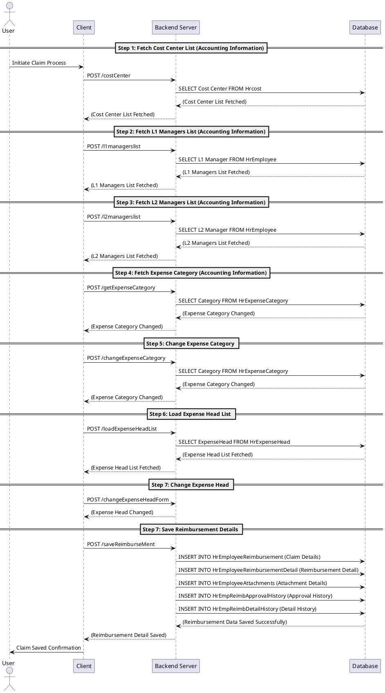
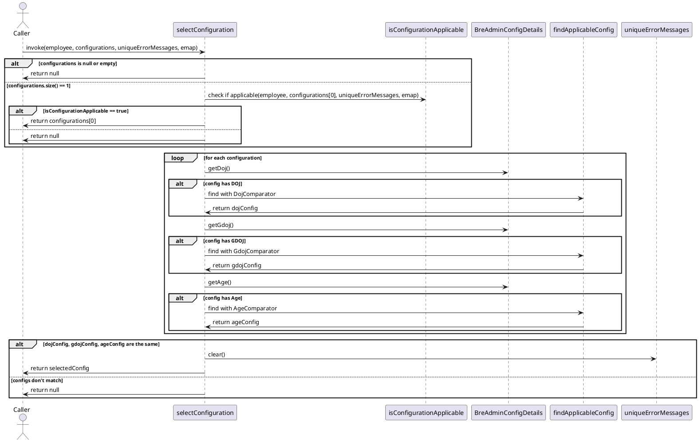
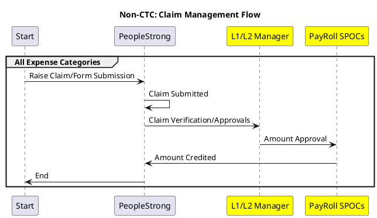

---
aliases:
  - Business related expenses
  - Business requirement expenses
  - BER
  - Business expenses related
  - non-CTC-claim
  - Reimbursement
  - non ctc claim
tags:
  - module
---
### Introduction

All the expenses that an employee has made from his own pocket for facilitation of smooth business qualify as business-related expenses. Under certain conditions, the business reimburses these expenses incurred by the employee.

The main difference between [[FBP Claim|CTC Claim]] vs [[Non CTC Claim]]:

**FBP Claim (CTC – claim)**: A Flexible Benefit Plan (FBP) claim allows employees to select certain components of their salary package that can be structured to maximize tax efficiency. By choosing from a variety of options such as medical expenses and conveyance, employees can reduce their taxable income, thereby enhancing their net take-home pay.

**Non-CTC Claim**: This pertains to expenses incurred by employees that are not covered under the Cost to Company ([CTC](CTC)) structure. These expenses are typically personal or work-related costs that arise after the disbursement of the salary and are not reimbursable by the employer as part of the standard compensation package.

### UI and Menus

Generally, all the modules managed by PNE fall under the category of 'Payroll,' which can be found in the table SysSubModule under the Module ID 7. All the payroll-related menus will also fall under the same parent menu on the UI.

Only [[Non CTC Claim|Reimbursement]] is an exception, which falls under the Module ID 8 and has its own separate UI drop down.

Primarily, there are 2 sub menus in Reimbursement on Employee Self Service (ESS):
- **New non-CTC claim**: The entry for an employee to raise a reimbursement claim.
- **My claims**: The history where the employee can see all the claims he has submitted so far.

There are 3 sub menus in Reimbursement on Manager Self Service (MSS):
- **All Claims page**: A listing page for the approver to see all the claims submitted by employees that are pending for any action to be taken.
- **Configuration page**: A setup page to configure expense heads and expense categories.
- **Reports page**: To see the reports (such as pending claims or comprehensive report).
- **Proxy Reimbursement**: The manager can submit reimbursement claims on behalf of their reporters based on the old role definition.

### [[Form Security]]

Mainly, there are two forms on ESS that need to be set up for the functioning of reimbursement:

1. **ReimbursementClaim**
3. **ReimbursementClaimDialogbox**

**Use case**: initiate, save, submit, re-submit after rejection.  
These forms can be utilised by either the employee or a proxy actor.

Similarly, on Manager Self-Service (MSS):

**Use case**: approval workflow after initiating

1. **ReimbursementApproval**
2. **ReimbursementApprovalDialogbox**
3. **ApprovalsListingPage**

The Reimbursement claim is specifically designed in such a way that it is divided into two parts: the reimbursement claim and the reimbursement claim dialog box. 

The purpose of this segregation was the re usability of the dialog box component, which is present on both ESS and MSS.

Each input field or drop down is configurable via form security.

All the contents of the following page belong to **ReimbursementClaim**.

Once you’ve selected the expense head, the reimbursement claim dialog box will be rendered. 

While the following panel falls under reimbursement claim dialog box 

At minimum, organisation-level form security must be present as, at the complete stage, organisation-level form security is required.

**Bill Period**: This is a system-level mandatory field. It is possible that the start date and end date may not align with the bill date.

### Cost Centre

**What is [[OrgUnitType]]? HrWorksitetype?** – HRIS part

[[HrOrgUnitType]] and [[HrWorksitetype]] both have a column called `IsCostCenterLevel`. However, only **HrOrgUnitType** is used in reference to display the cost centre on the UI.

For instance, in PeopleStrong, the following hierarchy level is followed.

Where Company > SBU > Business Unit > Function > Sub-function > Project Code 

If the ‘sub function’ level is marked as cost centre level, then all the employees falling under ‘sub function 'or all its children (‘project code’ here) will be mapped for cost centre. 

There are instances in other organisations where the employee is not necessarily mapped to the last level. It is possible that the employees will fall to a higher level as well.  

The [[module config]] for Cost Centre level which is used in BRE is present in the HRIS configuration part for module config and not in payroll. 

If this cost center is set to true, by default the cost center gets populated on the drop down. 

The table [[HrCost]] is a system level table where all the cost centres are stored.  

The Table [[HrCostCentre]] has all the mapping from [[hrcost]] with its respective organisation, the contents of this table are presented on the UI for drop down of Cost centre. 

### L1/L2 manager 

By default, the L1 and L2 are populated as per user's configuration. If by form security it set to false, the claim requests will any how go to the configured L1, otherwise if enabled, you can change them. 

### HrExpenseCategory 

In [[HrExpenseCategory]] we store all the expense categories available in the system, which can be added via UI on admin. The column ExpenseCategoryType  is specifically used to hardcore in code.  

In total we have hard coded the following 3 expense categories in code which on selection have an extra handling.  

For example, when selected ‘entertainment’ we get an option to accept the input the list of attendees. 

On selecting Travel / domestic travel / international travel you’ll get the option to select the start date, end date 

On selecting relocation, from and to place of re location. 

The column Role ID in this table says that only this role can generate report for this particular expense category. 

### HrExpenseHead

[[HrExpenseHead]] is  subcategory of [[HrExpenseCategory]].  

### HrconveyanceRate

When the expense category is selected as conveyance we fetch conveyance data from the [[HrconveyanceRate]], here in case of four/two-wheeler, there is a column called ‘rate’. Based on the distance travelled the total claimed amount is calculated. 
Which is distance travelled * rate. 

### Saving a claim  

In Bre the claim code is generated as soon as you save the claim, which can be viewable on my claims page. 
Per claim you can have only one expense category, and multiple heads. 
If the workflow has not begun, you can save and delete the claims as many times as you want.   

### Approval  

There are two ways to navigate to the approval page, one is via my task, the other is via manager self-service. The listing page that opens via my task is a common task page, that shows pending actionable tasks at the users end.  

You cannot approve with zero as approved amount.  

There 2 ways one can approve: 

1. The claim page opens, and you just click the approve button, in this case if the approved amount exists it will be populated with the same, otherwise the employees claim amount will be populated as claim amount. 
2. The Claim page opens but the approver edits the claim amount or approve amount.  

### All Claim Page  

In this page you can see the listing of all employee claims, this page is particularly used to update the payment details. One can download the payment details in an excel or spreadsheet format, updating the payment details and upload it manually. The system processes it, no workflow is required, the scheduler will process it. 

### Attachments 

Generally, we have two types of attachment in a claim 

1. The attachment that attaches with category  
2. The attachment that attaches with head. 

The attachments are stored in a table called [[HrEmployeeAttachements]].  

Here, in the case of category attachments, the contextinstanceid is stored of [[HremployeeReimbursement]].  

And in the case of Expensehead, the contextInstanceId is stored of [[HremployeeReimbursementDetails]]. 

The file attachments of CTC and non CTC claim are stored in this table, [[HrEmployeeAttachments]].  

### Configuration

Primarily, the most important factor in BRE is the calculation and configuration of the eligibility amount. Eligibility amount can be configured on a lot of diverse bases, and each client has its own requirements.

There are 2 ways to configure Business Related Expenses:

1. **Drools**  
   Drools runs on its own micro service, which is called via Work-life. Drools is a rule engine where you pass in various rules that should be triggered when certain conditions are met, and it fires them accordingly. However, over the years, it has become quite unreliable. As the number of clients increased, so did the memory requirements for Drools. It often misfires the rules, and deployment issues have been observed. Many consistency issues also emerged as Drools scaled from a single node to multiple nodes, often necessitating server restarts that could only be done at specific times.

2. **BRE Admin Configuration**  
   This is a setup page available in the admin section and serves as a replacement for Drools. By assessing the requirements of Non-CTC claims and Drools, a custom solution was developed. BRE Admin Configuration operates on employee groups. New and existing clients have begun migrating from Drools to the new setup.

### Drools

The configuration page for Drools falls under the HRIS menu:

**HRIS menu > Manager Self Service > Configuration > Rules**

This is the landing page for Drools, all configured rules are presented here on the listing. 

The actionable items on this page are  

1. Clicking on the Rule name will open a new page for further configuration of that rule. 
2. The Action button on the last, to deploy and undeploy these rules. 
3. Configuring the parameters for rule by clicking on ‘show rule params’There are 4 tables used to store Drools configuration  

[[SysRuleEngineConfig]] – main table where rules are stored  
[[SysRuleEngineConfigParam]] – parameters for rules 
[[SysRuleEngineParamGroup]] – stores the combination of params and rules  
[[SysRuleEngineData]] – the data store for each param  

### Bre Admin Configuration  

Bre Admin configuration can be found in Admin pages. To navigate to its menu.
Reimbursement > Bre Admin Configuration 
Instead of configuring drools according to parameter values, which can increase a lot and be hard to manage, we shifted from managing on parameter basis to [[expense head]] and employee group basis 

Currently the configurations that can be set up on this page are all inclusive of its range. For example, if the age is set to 30 years, all the employees that fall under 30 years are eligible for that head.  

In later phases, we will update this to support exclusive as well as equality on the given conditions.  

One distinction between drools and bre admin is that in drools when setup is present, you’ll get to see all the expense category and all the expense heads available.  

In Bre admin, you'll only see those categories and head which are configured by the admin. 

We have a total of 20 free fields and 10 free drop down fields, that have no business logic, the client can configure them as they like it. 

There is a checkbox as well, where 5 free fields, and 5 free drop downs are linked, in case the check box is true they will be visible. 

The Tables that are user for Bre admin are 
[[BreAdminConfig]] and [[BreAdminconfigDetails]]

### Eligibility Amount 

99999 or NA, both represent the same thing. 

If you claim more than an eligible amount, that claim will be flagged as an excess claim, and you may need to enter excess claim comments.  

Based on the configuration, it is possible that some claims cannot cross the eligibility amount, and you may not be able to submit an excess claim.’ 

There are 5 ways eligibility amount can be shown on UI. 

1. Per transaction 
2. Per day  
3. Per month (default if no setup)    
4. Per date range    
5. Per financial year
6. Per calendar year 

If during setup, if more than configuration is present, say per day and per date range.  
Then system will calculate it according per date range, as presidency is as follows  
Per transaction < Per day < Per month< Per date range < Per financial year < Per calendar year   

**Per transaction**  
For every expense category, each expense head that you may add and save will be counted as per transaction. 

**Per day** 
This will depend on the input selected on the bill date drop down. 

**Per month** 
This will depend on the input selected on the bill period drop down. 

**Date range** 
This will depend on Start date and end date selected on the UI  

Total eligibility = Per day eligibility x Date range 

There is a concept of reducing days here also, if reduce days are configured it will be reduced from date range. 

Per financial year  
Dates configured for that [[HrFinancialYear|financial year]] that are present in [[HrFinancialYear]] 

**Per Calendar year**  

Normal calendar year or custom setup done by client. 
On Admin there is configuration of expense categories,  
Here there is configuration for excess claim context.  

1. This is used to configure what is the default expense head    
2. What to combine for duplicate bills    
3. Check for balance and eligibility amount

To enable Dynamic workflow you need to enable the module config of it first.

## Related Classes

### Java Classes

*Note: All respective JSF Action pages have beans named with the same names.*

- **ReimburseMentClaimAction**  
  - **Context**: Web  
  - **Purpose**: Employee submitting a new claim
  
- **ReimbursementClaimRestService**  
  - **Context**: Mobile  
  - **Purpose**: Employee submitting a new claim
  
- **ReimbursementController**  
  - **Context**: Outbound  
  - **Purpose**: Employee submitting a new claim
  
- **AllReimburseMentClaimStatusAction**  
  - **Context**: Web  
  - **Purpose**: Action page for all reimbursement claims
  
- **HrReimburseMentClaimAction**  
  - **Context**: Web  
  - **Purpose**: Approver page for taking action
  
- **ReimbursementProxyAction**  
  - **Context**: Web  
  - **Purpose**: Approver page for setting up a proxy reimbursement
  
- **LakhsFormatConverter**  
  - **Context**: Web  
  - **Purpose**: Helper class for converting into Lakhs notation
  
- **HrReimburseMentClaimRestService**  
  - **Context**: Mobile  
  - **Purpose**: Approver class for taking action

### UI Classes

- **ReimburseMentClaim.xhtml**  
  - **Context**: Web  
  - **Purpose**: Employee submitting a new claim
  
- **CommonModalPanel.xhtml**  
  - **Context**: Web  
  - **Purpose**: Employee dialogue box for filling claim details
  
- **ReimburseMentClaimStatus.xhtml**  
  - **Context**: Web  
  - **Purpose**: Status page for viewing saved and processed claim details
  
- **ReimbursementProxy.xhtml**  
  - **Context**: Web  
  - **Purpose**: Proxy page for raising proxy claims
  
- **HrReimburseMentClaim.xhtml**  
  - **Context**: Web  
  - **Purpose**: Approver page for approving claims
  
- **HrCommonModalPanel.xhtml**  
  - **Context**: Web  
  - **Purpose**: Dialogue box for approvers
  
- **AllReimbursementClaimStatus.xhtml**  
  - **Context**: Web  
  - **Purpose**: Page for viewing all claims

### BRE Tables

#### Main BRE Tables

- **HrEmployeeReimbursement**
- **HrEmployeeReimbursementDetail**
- **HrEmployeeAttachments**
- **HrEmpReimbApprovalHistory**
- **HrEmpReimbDetailHistory**
- **hremployeereimbursementpayment**
- **AltDataManager..Raw_EmployeeReimbursementPayment**

#### Supporting Tables

- **hrexpensecategory**
- **hrexpensehead**
- **hrconveyancerate**

#### New Drool Config Pages

- **BreAdminConfig**
- **BreAdminConfigDetails**

```plantuml
@startuml

skinparam class {
    BackgroundColor<<HrEmployeeReimbursement>> #FFDDDD
    BackgroundColor<<HrEmployeeReimbursementDetail>> #DDFFDD
    BackgroundColor<<HrEmployeeAttachments>> #DDDDFF
    BackgroundColor<<HrEmpReimbApprovalHistory>> #FFFFDD
    BackgroundColor<<HrEmployeeReimbursementPayment>> #FFDDFF
    BackgroundColor<<Raw_EmployeeReimbursementPayment>> #DDFFFF
    BackgroundColor<<HrExpenseCategory>> #FFDDDD
    BackgroundColor<<HrExpenseHead>> #DDFFDD
    BackgroundColor<<HrConveyanceRate>> #DDDDFF
    BackgroundColor<<BreAdminConfig>> #FFFFDD
    BackgroundColor<<BreAdminConfigDetails>> #FFDDFF
}

class HrEmployeeReimbursement <<HrEmployeeReimbursement>> {
    +bigint ReimbursementID
    +varchar(150) ClaimCode
    +int EmployeeID
    +int L1managerID
    +int L2managerID
    +int StageID
    +bigint ExpenseCategoryID
    +int CostCenterID
    +int TenantID
    +int StartDateID
    +int EndDateID
    +nvarchar(500) TravelTo
    +nvarchar(500) TravelFrom
    +bit Budgeted
    +bit PreTravelApproval
    +nvarchar(500) AttendeesList
    +bit IsActive
    +int FinalstageApprover
    +varchar(500) Status
    +int TravelModeTypeID
    +nvarchar(500) PurposeOfTravel
    +datetime ApplicationDateID
    +bit Bookedbycompany
    +int CreatedBy
    +int ModifiedBy
    +datetime CreatedDate
    +datetime ModifiedDate
    +varchar(50) WbsNumber
    +nvarchar(100) FileName
    +nvarchar(100) FilePath
    +bit IsClaimViaSMS
    +timestamp Rowkey
    +int CostID
    +datetime2 SysStartTime
    +datetime2 SysEndTime
}

class HrEmployeeReimbursementDetail <<HrEmployeeReimbursementDetail>> {
    +bigint ReimbursementDetailID
    +bigint ReimbursementID
    +bigint ExpenseHeadID
    +numeric(15,5) EligibleAmount
    +nvarchar(100) VendorName
    +nvarchar(100) BillNumber
    +int StartDateID
    +int EndDateID
    +int BillDateID
    +int PaymentModeTypeID
    +numeric(15,5) ClaimedAmount
}

class HrEmployeeAttachments <<HrEmployeeAttachments>> {
    +bigint HrAttachmentID
    +int ContextEntityID
    +bigint ContextInstanceID
    +nvarchar(200) SysFileName
    +nvarchar(1024) SysFilePath
    +nvarchar(200) UserFileName
    +int CreatedBy
    +int ModifiedBy
    +datetime CreatedDate
    +datetime ModifiedDate
    +int FileSize
    +int TenantID
    +int OrganizationID
    +timestamp Rowkey
}

class HrEmpReimbApprovalHistory <<HrEmpReimbApprovalHistory>> {
    +bigint ReimbApprovalHistoryID
    +bigint ReimbursementID
    +bigint WorkflowHistoryID
    +int UserID
    +nvarchar(500) Status
    +nvarchar(500) Remarks
    +numeric(15,2) TotalApprovedAmount
    +int TenantID
    +int CreatedBy
    +int ModifiedBy
    +datetime CreatedDate
    +datetime ModifiedDate
    +int RejectionReasonId
    +datetime RowKeyTime
    +int DesignationId
    +int GradeId
}

class HrEmployeeReimbursementPayment <<HrEmployeeReimbursementPayment>> {
    +bigint HrEmployeeReimbursementPaymentid
    +bigint ReimbursementID
    +bit Active
    +nvarchar(600) ReferenceNo
    +numeric(12,2) Amount
    +nvarchar(200) PaymentDate
    +nvarchar(1000) Status
    +nvarchar(1000) Remark
    +int OrganizationId
    +int TenantId
    +int CreatedBy
    +datetime CreatedDate
    +datetime ModifiedDate
    +timestamp Rowkey
}

class Raw_EmployeeReimbursementPayment <<Raw_EmployeeReimbursementPayment>> {
    +bigint HrEmployeeReimbursementPaymentID
    +bigint ReimbursementID
    +bigint EmployeeID
    +bigint TransactionID
    +bit isActive
    +bit isValid
    +bit isProcessed
    +nvarchar(600) ClaimCode
    +nvarchar(600) ReferenceNo
    +numeric(15,5) Amount
    +nvarchar(200) PaymentDate
    +nvarchar(1000) Status
    +nvarchar(1000) Remark
    +int OrganizationId
    +int TenantId
    +int CreatedBy
    +datetime CreatedDate
    +datetime ModifiedDate
}

class HrExpenseCategory <<HrExpenseCategory>> {
    +bigint ExpenseCategoryID
    +nvarchar(100) ExpenseCategoryName
    +nvarchar(250) ExpenseCategoryDesc
    +int ExpenseTypeID
    +int OrganizationID
    +int TenantID
    +nvarchar(100) ExpenseCategoryType
}

class HrExpenseHead <<HrExpenseHead>> {
    +bigint ExpenseHeadID
    +nvarchar(100) ExpenseHeadName
    +nvarchar(250) ExpenseHeadDesc
    +bigint ExpenseCategoryID
    +int TenantID
    +bit Active
    +datetime CreatedDate
    +datetime ModifiedDate
    +bit PerTransaction
    +bit PerDay
}

class HrConveyanceRate <<HrConveyanceRate>> {
    +int ConveyanceRateID
    +nvarchar(100) ConveyanceTypeName
    +nvarchar(100) ConveyanceType
    +numeric(10,2) Rate
    +int OrganizationID
    +int TenantID
    +bit IsActive
    +int CreatedBy
    +int ModifiedBy
    +datetime CreatedDate
    +datetime ModifiedDate
}

class BreAdminConfig <<BreAdminConfig>> {
    +int BreAdminConfigID
    +int EmployeeGroupID
    +int ExpenseCategoryID
    +int ExpenseHeadID
    +int ConvenienceModeID
    +varchar(50) Name
    +bit Age
    +bit Experience
    +bit Doj
    +bit Gdoj
    +bit Active
    +int OrganizationID
    +int TenantID
}

class BreAdminConfigDetails <<BreAdminConfigDetails>> {
    +int BreAdminConfigDetailsID
    +int BreAdminConfigID
    +int AgeYears
    +int AgeMonths
    +int Experience
    +int Doj
    +int Gdoj
    +bit EligibilityFlag
    +numeric(22,5) EligibilityAmount
    +numeric(22,5) Rate
    +bit ExcessFlag
}

HrEmployeeReimbursementDetail -- HrEmployeeReimbursement : "ReimbursementID"
HrEmployeeReimbursementDetail -- HrExpenseHead : "ExpenseHeadID"
HrEmployeeReimbursement -- HrExpenseCategory : "ExpenseCategoryID"
HrEmployeeReimbursement -- HrEmployeeReimbursementPayment : "ReimbursementID"
HrEmpReimbApprovalHistory -- HrEmployeeReimbursement : "ReimbursementID"
HrEmployeeAttachments -- HrEmployeeReimbursement : "ReimbursementID"
HrEmployeeReimbursementPayment -- Raw_EmployeeReimbursementPayment : "ReimbursementID"
HrEmployeeReimbursementPayment -- HrEmployeeReimbursementDetail : "ReimbursementID"
HrExpenseHead -- HrExpenseCategory : "ExpenseCategoryID"
BreAdminConfig -- HrExpenseCategory : "ExpenseCategoryID"
BreAdminConfig -- HrExpenseHead : "ExpenseHeadID"
BreAdminConfigDetails -- BreAdminConfig : "BreAdminConfigID"

@enduml

@enduml
```

### Work Life 

### Submitting a claim 
For submitting a claim There 3 entry points for BRE.

- RimburseMentClaimAction - JSF
- ReimbursementClaimRestService - Mobile APIs
- ReimbursementController - Out Bound APIs

The primary Class for BRE is `ReimburseMentClaimAction`, as this is the class we interact with on web and has the complete set of features present with respect to the other 2.

### Bre Admin Logic 

### Approval workflow 

- HrRimburseMentClaimAction - JSF
- HrReimbursementClaimRestService - Mobile APIs
- 

